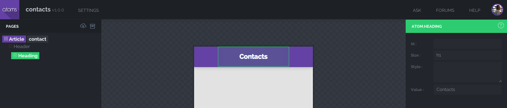

# Atoms App Example

En este ejemplo vamos a construir el esqueleto de la app desde el [IDE](http://atoms.tapquo.com) e implementar una API REST con **MongoDB** y **Node.js** utilizando [ZEN-server](https://github.com/soyjavi/zen-server).

*Cualquier duda o sugerencia no dudéis en contactar ;-)*


- [Nuevo proyecto](#a.1)
- [Diseño](#a.2)
      - [Organism / Molecule / Atom](#a.2.1)
      - [Section](#a.2.2)
      - [Navegación](#a.2.3)
      - [Compilar y descargar](#a.2.4)
          - [Estructura del proyecto](#a.2.4.1)
- [Code](#a.3)
  - [Coffee](#a.3.1)
    - [Capturando el evento](#a.3.1.1)
  - [Backend](#a.3.2.)
    - [ZENserver](#a.3.2.1)
    - [API y Modelo](#a.3.2.2)
- [Vuelta al front](#a.3.3)
    - [Enviando los datos al servidor](#a.3.3.1)
    - [Entity](#a.3.3.2)
    - [Callbacks personalizados](#a.3.3.3)
    - [Cargando datos](#a.3.3.4)

<a name="a.1"/>
## 1. Nuevo proyecto
Vamos a http://atoms.tapquo.com y creamos un nuevo proyecto. En este ejemplo, crearemos una app en la que podamos añadir un nuevo contacto y listarlos.


<a name="a.2"/>
## 2. Diseño
En esta primera aproximación nuestra app contendrá un artículo y dos secciones: en una de las secciones se listarán los contactos. Posteriormente, añadiremos mediante código una **Molecule Search**. En la segunda sección estará la **Molecule Form** con la que añadiremos nuevos contactos.

<a name="a.2.1"/>
## 2.1. Organism / Molecule / Atom


Para crear el *Header* que vemos en la imagen comenzamos arrastrando un **Article** del grupo de *Elements* que se encuentra abajo a la izquierda del IDE. A continuación, podemos hacer doble click o arrastrar un **Organism Header** al cual añadiremos un **Atom Heading** con el título de la app. Este título lo podemos editar a la derecha del IDE en la casilla **Value**.

A continuación, nos volvemos a posicionar sobre el *Organism Header* desde el árbol de elementos para añadir dos **Molecules Navigation** que contendrán los botones que nos llevarán a las distintas secciones.

En este ejemplo para posicionar cada botón a un lado, debemos decir a la *Molecule Navigation* que llevará el estilo *left* en un caso y *right* en el otro:


Una vez posicionadas las *Molecules Navigations* a cada lado, podemos añadir los botones. Para ello nos posicionamos desde el árbol en la molécula y arrastramos un botón. Puedes poner un texto o un icono. Al hacer click en la casilla de *icon* se nos despliegan una lista de iconos. Para este ejemplo, nos podemos ayudar del buscador para encontra los iconos *menu* y *user-add*:


Como has podido observar, cada vez que nos posicionamos en un elemento del árbol se nos muestran únicamente los elementos permitidos para ese Organismo o Molécula.

<a name="a.2.2"/>
## 2.2. Sections

Como hemos dicho anteriormente, nuestra app contendrá dos secciones. Para ello, nos posicionamos sobre el *Organism Article* del árbol para poder seleccionar el **Organism Section**.

Este organismo permite unos cuantos elementos más. Debido a que esta vista será para listar nuestros contactos, arrastraremos al *Section* un **Molecule List**.


Habrás podido observar que la *Molecule List* contiene varios parámetros que podemos configurar. De momento configuraremos los valores que ves en la imagen pero más adelante explicaremos qué representan. De todas formas, en este [enlace](https://github.com/soyjavi/atoms-documentation/tree/master/ES) encontrarás la documentación necesaria para identificar estos parámetros.

Recordemos que podemos ir guardando nuestro trabajo pinchando en el icono de la nube arriba a la izquierda.

La siguiente sección la creamos de la misma manera que la anterior. En esta añadiremos el formulario con dos *inputs* y un botón de guardar:

Para añadir el formulario a la sección nos posicionamos sobre ella en le árbol de elementos y arrastramos la **Molecule Form**:


A la *Molecule Form* podemos añadir los **Atoms Input** y **Atoms Button**. De los distintos valores que acepta el *atom inpput* configuraremos los siguientes:

* **name**: campo requerido que identifica el input
* **type**: tipo de dato del input (number, text, password...)
* **placeholder**: descripción del input


Para que tu botón se vea ancho y de color verde como en este ejemplo, puedes poner en su campo *style* los valores *fluid accept*

Ya casi estamos listos :) Lo que podemos hacer a continuación es darle un poco de estilo al formulario. Si vamos a su *Section* y escribimos *padding* en su campo *style*, le daremos márgenes. No te preocupes mucho por la estética desde el IDE ya que desde la carpeta *style* del proyecto podrás transformar por completo la app.

<a name="a.2.3"/>
## 2.3. Navegación

Te habrás dado cuenta que en *Articles* y *Sections* es obligatorio asignarles una **ID**. Para este ejemplo elegimos asignar al article el ID *contact*. La section que contiene la lista se llamará *list* y la que contiene el formulario *form*.

Una vez signadas los IDs podemos establecer la navegación de los botones. Por ejemplo, si queremos que al pinchar en el botón *user-add* el usuario vaya al formulario, basta con elegir esa ruta en el campo **path** del botón tal y como se ve en la figura:


Le podemos asignar la ruta *contact/list* al botón menú siguiendo los mismos pasos descritos.

<a name="a.2.4"/>
## 2.4. Compilar y descargar

Para compilar y obetener el proyecto debemos guardar todos los cambios y hacer click sobre el icono de la cajita arriba a la izquierda.

Se nos deplegará un *dialog* que nos pedirá la ruta de arranque, es decir, debemos asignar en qué pantalla se iniciará la app. En este ejemplo, no hemos implementado un control de sesión así que la primera pantalla será la lista de contactos:


Ahora damos a **Build & Export** y guardamos el zip que nos ha generado Atoms IDE.

<a name="a.2.4.1"/>
### 2.4.1. Estructura del proyecto
Al descomrpimir el zip nos encontramos con la siguiente estructura de carpetas:

```
.
├── source
│   └── atoms
│   └── entities
│   └── molecules
│   └── organisms
│   └── style
│   └── app.coffee
│   └── app.proxy.coffee
├── www
│   └── assets
│   └── index.html
├── bower.json
├── gulpfile.js
├── package.json
```
En este momento ya podemos arrancar nuestra aplicación. Pero antes, debemos instalar las dependencias y los componentes declaramos en el *package.json* y *bower.json*:

```bash
$ npm install
$ bower install
```
Ahora compilamos los fichero con gulp y levantamos un servidor:

```bash
$ gulp init
$ gulp
```

Al ejecutar el comando `gulp` se nos levantará un server en el puerto 8000. Comprobemos que tal se nos ve la app:


<a name="a.3"/>
## 3. Code
Es momento de interactuar con el scaffod y el coffee. Desde nuestro editor de código, vamos a la carpeta **Organisms**. Al haber creado un único organismo *contact* vemos que solamente tenemos un fichero yaml que contiene el scaffold y el coffee que tendrá la lógica.

<a name="a.3.1"/>
### 3.1. Coffee

```coffee
class Atoms.Organism.Contact extends Atoms.Organism.Article

  @scaffold "assets/scaffold/contact.json"

  # -- Children bubble events --------------------------------------------------
  onButtonTouch: (event, dispatcher, hierarchy...) ->
    # Your code...

  onFormSubmit: (event, dispatcher, hierarchy...) ->
    # Your code...

new Atoms.Organism.Contact()
```

El fichero coffee viene con dos funciones declaradas. Esto es porque hemos dejado el *select* del atributo **events** activado en los tres elementos (buttons y form) y el nombre por defecto que le asigna Atoms cuando no personalizamos el callback es *onElementEvent*:


<a name="a.3.1.1"/>
#### 3.1.1. Capturando el evento
Te invito a que pongas logs en el método **onFormSubmit** y veas qué nos llega al hacer click en **Save** en *event*, *dispatcher*, *hierarchy*.

Si los analizas verás que lo elementos hablan por si solos pero te confirmo que *hierarchy* te dice por qué "padres" pasa el evento.

Puedes recuperar los datos del formulario con *dispatcher.value()*:

 ```coffee
  onFormSubmit: (event, dispatcher, hierarchy...) ->
    console.log ">>", dispatcher.value()
 ```


<a name="a.3.2"/>
### 3.2. Backend
Este ejemplo pretende enseñar el flujo de comunicación desde la app hasta el backend que porcesará y almacenará los datos del formulario. Para el manejo de servidores HTTP utilizaremos [ZENserver](https://github.com/soyjavi/zen-server) que se caracteriza por ser ligero en cuanto a dependencias.

Para utilizar ZENserver lo instalamos de la siguiente manera:

```bash
$ npm install zenserver --save
```

<a name="a.3.2.1"/>
#### 3.2.1. ZENserver
Nuestro pequeño backend tendrá una API para guardar y devolver los contactos y utilizaremos MongoDB para la persistencia de los datos.

Así, siguiendo la estructura de fichero que maneja ZENserver vamos a añadir a nuestro proyecto los siguiente ficheros y directorios:

```
.
├── api
│   └── contact.coffee
├── common
│   └── models
│       └── contact.coffee
├── environment
│   └── dev.yml
├── zen.js
├── zen.yml
```
Añade el siguiente contenido a los fichero zen.js y zen.yml:

*zen.js*:

```js
"use strict"
require('zenserver').start();
```
*zen.yml*

```yaml
# -- RESTful services ----------------------------------------------------------
api:
  - contact

# -- Environment ---------------------------------------------------------------
environment: dev

# -- CORS Properties -----------------------------------------------------------
headers:
  Access-Control-Allow-Origin: "*"
  Access-Control-Allow-Credentials: true
  Access-Control-Allow-Methods: GET,PUT,POST,DELETE
  Access-Control-Max-Age: 1
  Access-Control-Allow-Headers:
    - Accept
    - Accept-Version
    - Content-Length
    - Content-MD5
    - Content-Type
    - Date
    - Api-Version
    - Response-Time
    - Authorization
  Access-Control-Expose-Headers:
    - api-version
    - content-length
    - content-md5
    - content-type
    - date
    - request-id
    - response-time
```
Para saber más sobre ZENserver, no olvides consultar su [documentación](https://github.com/soyjavi/zen-server/tree/master/documentation/ES) ;)

Siguiendo con la configuración de los demás ficheros, nos queda establecer los datos del entorno dev. Así, *dev.yml* contiene la siguiente información:

```yaml
# -- General Info --------------------------------------------------------------
host    : localhost
port    : 8888
timezone: Europe/Amsterdam

# -- Services ------------------------------------------------------------------
mongo:
  - name    : primary
    host    : 127.0.0.1
    port    : 27017
    db      : contact
```
Si tu MongoDB requiere autenticación, añade los campos `user` y `password` a `mongo`.

<a name="a.3.2.2"/>
#### 3.2.2. API y Modelo
Empecemos a establecer los parámetros de nuestro modelo de Mongo. Para este ejemplo he querido hacerlo súper sencillo y por lo tanto mi modelo lo he configurado de la siguiente manera:

```coffee
"use strict"

Hope    = require("zenserver").Hope
Schema  = require("zenserver").Mongoose.Schema
db      = require("zenserver").Mongo.connections.primary

Contact = new Schema
  name      : type: String
  avatar    : type: String
  phone     : type: Number
  updated_at: type: Date
  created_at: type: Date, default: Date.now

# -- Static methods ------------------------------------------------------------
Contact.statics.register = (parameters) ->
  promise = new Hope.Promise()
  today = new Date()
  parameters.avatar = "http://robohash.org/#{today.getMilliseconds()}.png"
  contact = db.model "Contact", Contact
  new contact(parameters).save (error, value) -> promise.done error, value
  promise

Contact.statics.search = (filter) ->
  promise = new Hope.Promise()
  @find(filter).exec (error, value) -> promise.done error, value
  promise

# -- Static methods ------------------------------------------------------------
Contact.methods.parse = ->
  name      : @name
  avatar    : @avatar
  phone     : @phone
  updated_at: @updated_at
  created_at: @created_at

exports = module.exports = db.model "Contact", Contact
```
Y mi fichero con los endpoints ha quedado así:

```coffee
"use strict"

Contact = require "../common/models/contact"

module.exports = (server) ->

  server.get "/api/contact", (request, response) ->
    Contact.search().then (error, result) ->
      if error
        response.json message: error.message, error.code
      else
        response.json contacts: (contact.parse() for contact in result)


  server.post "/api/contact", (request, response) ->
    if request.required ["name", "phone"]
      Contact.register(request.parameters).then (error, result) ->
        if error
          response.json message: error.message, error.code
        else
          response.json contact: result.parse()
```

<a name="a.3.3"/>
### 3.3. Vuelta al front
Para comunicarnos con la API nos ayudaremos del fichero *app.proxy.coffee* que trae Atoms IDE. Para ese ejercicio nos bastará con configurar la url del server:

```coffee
...
    $$.ajax
      url         : "http://127.0.0.1:8888/api/#{method}"
...
```

<a name="a.3.3.1"/>
#### 3.3.1. Enviando los datos al servidor
Ya podemos intentar enviar los datos de un contacto a la base de datos. Para ello debemos recuperar los datos del formulario y pasarlos al proxy:

```coffee
  onFormSubmit: (event, dispatcher, hierarchy...) ->
    __.proxy("POST", "contact", dispatcher.value()).then (error, result) ->
      console.log ">>", error, result
```
Ahora, con gulp corriendo en una terminal y en otra con el server levantado:

```bash
$ node zen zen
```

Vamos a ver qué pasa al completar el formulario y darle al *Save*:


Por lo que parece, todo ha ido bien. Si nos fijamos en la respuesta del server, éste nos devuelve un 200 a la llamada `POST` al endpoint `/api/contact`. Por otro lado vemos en el log de la consola del navegador que tenemos los datos del usuario. Construyamos entonces la nueva entidad.

<a name="a.3.3.2"/>
#### 3.3.2. Entity
Para añadir a la lista el nuevo contacto creado, previamente debemos crear la **Entity Contact**. En la carpeta entity creamos el fichero *contact.coffee* y añadimos el siguiente contenido:

```coffee
"use strict"

class __.Entity.Contact extends Atoms.Class.Entity

  @fields "name", "phone", "avatar"

  parse: ->
    image       : @avatar
    text        : @name
    description : @phone
```
El template de un Atom Li acepta además de los atributos declarados en el parse el atributo *icon*. Lo puedes comprobar [aquí](https://github.com/tapquo/atoms-app/blob/master/atom/li.coffee).

Recordemos que la *Molecule List* está suscrita a los eventos de **create**, **update** y **destroy** así que, para añadir el nuevo elemento a la lista, basta con llamar al método *create* de la Entity:

```coffee
  onFormSubmit: (event, dispatcher, hierarchy...) ->
    __.proxy("POST", "contact", dispatcher.value()).then (error, value) ->
      if value
        __.Entity.Contact.create value.contact
        Atoms.Url.path "contact/list"
```


<a name="a.3.3.3"/>
#### 3.3.3. Callbacks personalizados
Cuando volvemos al formulario para añadir un nuevo contacto nos damos cuenta que los valores del anterior singuen ahí. Para limpiar el formulario vamos a hacer algunos cambios en el yaml y por consiguiente el coffee.

Cuando hemos diseñado la app desde el IDE habíamos asignado un *path* a los botones de navegación. El de *add-user* nos llevaba a *contact/form*. Ahora lo que haremos será eliminar el atributo path y añadiremos un callback personalizado para poder limpiar el formulario cuando volvamos a el:

```yaml
...
  - Molecule.Navigation:
      style: right
      children:
        - Atom.Button:
            events:
              - touch
            icon: add-user
            callbacks:
              - onAdd
...
```
Otro factor importante a tener en cuenta es que gracias a las IDs podemos acceder a los elementos de manera directa. Para poder acceder a la *molecule form* y llamar al método *clean()* debemos asignar una ID (en este caso la hemos llamado *new*) a *la molecule*:

```yaml
  - Organism.Section:
      id: form
      style: padding
      children:
        - Molecule.Form:
            id: new
            events:
              - submit
            children:
              - Atom.Input:
                  type: text
                  name: name
                  placeholder: Name...
              - Atom.Input:
                  type: number
                  placeholder: Phone Number...
                  name: phone
              - Atom.Button:
                  events:
                    - touch
                  style: fluid accept
                  text: Save
```

Ahora, en el coffee podemos recoger el callback donde haremos la transición y limpiaremos el formulario:

```coffee
  onAdd: (event, dispatcher, hierarchy...) ->
    @form.new.clean()
    Atoms.Url.path "contact/form"
```

<a name="a.3.3.4"/>
#### 3.3.4. Cargando datos
Para listar todos los elementos que hemos guardado, vamos a añadir una llamada desde *app.coffee* a un nuevo método llamado **fecth** declarado en el *Organism.Contact*:

*app.coffee*

```coffee
"use strict"

Atoms.$ ->
  console.log "------------------------------------------------------------"
  console.log "Atoms v#{Atoms.version} (Atoms.App v#{Atoms.App.version})"
  console.log "------------------------------------------------------------"

  Atoms.Url.path "contact/list"
  __.Article.Contacts.fetch()

```

*contact.coffee*

```coffee
  fetch: ->
    __.proxy("GET", "contact").then (error, value) ->
      __.Entity.Contact.create contact for contact in (value.contacts or [])

```
