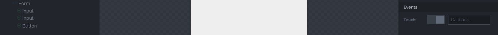

# Atoms App Example

## 1. Nuevo proyecto
Vamos a http://atoms.tapquo.com y creamos un nuevo proyecto. En este ejemplo, crearemos una app en la que podamos añadir un nuevo contacto y listarlos.


## 2. Diseño
En esta primera aproximación nuestra app contendrá un artículo y dos secciones: en una de las secciones se listarán los contactos. Posteriormente, añadiremos mediante código una **Molecule Search**. En la segunda sección estará la **Molecule Form** con la que añadiremos nuevos contactos.

## 2.1. Organism / Molecule / Atom


Para crear el *Header* que vemos en la imagen comenzamos arrastrando un **Article** del grupo de *Elements* que se encuentra abajo a la izquierda del IDE. A continuación, podemos hacer doble click o arrastrar un **Organism Header** al cual añadiremos un **Atom Heading** con el título de la app. Este título lo podemos editar a la derecha del IDE en la casilla **Value**.

A continuación, nos volvemos a posicionar sobre el *Organism Header* desde el árbol de elementos para añadir dos **Molecules Navigation** que contendrán los botones que nos llevarán a las distintas secciones.

En este ejemplo para posicionar cada botón a un lado, debemos decir a la *Molecule Navigation* que llevará el estilo *left* en un caso y *right* en el otro:


Una vez posicionadas las *Molecules Navigations* a cada lado, podemos añadir los botones. Para ello nos posicionamos desde el árbol en la molécula y arrastramos un botón. Puedes poner un texto o un icono. Al hacer click en la casilla de *icon* se nos despliegan una lista de iconos. Para este ejemplo, nos podemos ayudar del buscador para encontra los iconos *menu* y *user-add*:


Como has podido observar, cada vez que nos posicionamos en un elemento del árbol se nos muestran únicamente los elementos permitidos para ese Organismo o Molécula.

## 2.2. Sections

Como hemos dicho anteriormente, nuestra app contendrá dos secciones. Para ello, nos posicionamos sobre el *Organism Article* del árbol para poder seleccionar el **Organism Section**.

Este organismo permite unos cuantos elementos más. Debido a que esta vista será para listar nuestros contactos, arrastraremos al *Section* un **Molecule List**.


Habrás podido observar que la *Molecule List* contiene varios parámetros que podemos configurar. De momento configuraremos los valores que ves en la imagen pero más adelante explicaremos qué representan. De todas formas, en este [enlace](https://github.com/soyjavi/atoms-documentation/tree/master/ES) encontrarás la documentación necesaria para identificar estos parámetros.

Recordemos que podemos ir guardando nuestro trabajo pinchando en el icono de la nube arriba a la izquierda.

La siguiente sección la creamos de la misma manera que la anterior. En esta añadiremos el formulario con dos *inputs* y un botón de guardar:

Para añadir el formulario a la sección nos posicionamos sobre ella en le árbol de elementos y arrastramos la **Molecule Form**:


A la *Molecule Form* podemos añadir los **Atoms Input** y **Atoms Button**. De los distintos valores que acepta el *atom inpput* configuraremos los siguientes:

* **name**: campo requerido que identifica el input
* **type**: tipo de dato del input (number, text, password...)
* **placeholder**: descripción del input


Para que tu botón se vea ancho y de color verde como en este ejemplo, puedes poner en su campo *style* los valores *fluid accept*

Ya casi estamos listos :) Lo que podemos hacer a continuación es darle un poco de estilo al formulario. Si vamos a su *Section* y escribimos *padding* en su campo *style*, le daremos márgenes. No te preocupes mucho por la estética desde el IDE ya que desde la carpeta *style* del proyecto podrás transformar por completo la app.


## 2.3. Navegación

Te habrás dado cuenta que en *Articles* y *Sections* es obligatorio asignarles una **ID**. Para este ejemplo elegimos asignar al article el ID *contact*. La section que contiene la lista se llamará *list* y la que contiene el formulario *form*.

Una vez signadas los IDs podemos establecer la navegación de los botones. Por ejemplo, si queremos que al pinchar en el botón *user-add* el usuario vaya al formulario, basta con elegir esa ruta en el campo **path** del botón tal y como se ve en la figura:


Le podemos asignar la ruta *contact/list* al botón menú siguiendo los mismos pasos descritos.

## 2.4. Compilar y descargar

Para compilar y obetener el proyecto debemos guardar todos los cambios y hacer click sobre el icono de la cajita arriba a la izquierda.

Se nos deplegará un *dialog* que nos pedirá la ruta de arranque, es decir, debemos asignar en qué pantalla se iniciará la app. En este ejemplo, no hemos implementado un control de sesión así que la primera pantalla será la lista de contactos:


Ahora damos a **Build & Export** y guardamos el zip que nos ha generado Atoms IDE.

### 2.4.1. Estructura del proyecto
Al descomrpimir el zip nos encontramos con la siguiente estructura de carpetas:

```
.
├── source
│   └── atoms
│   └── entities
│   └── molecules
│   └── organisms
│   └── style
│   └── app.coffee
│   └── app.proxy.coffee
├── www
│   └── assets
│   └── index.html
├── bower.json
├── gulpfile.js
├── package.json
```
En este momento ya podemos arrancar nuestra aplicación. Pero antes, debemos instalar las dependencias y los componentes declaramos en el *package.json* y *bower.json*:

```bash
$ npm install
$ bower install
```
Ahora compilamos los fichero con gulp y levantamos un servidor:

```bash
$ gulp init
$ gulp
```

Al ejecutar el comando `gulp` se nos levantará un server en el puerto 8000. Comprobemos que tal se nos ve la app:


## 3. Code
Es momento de interactuar con el scaffod y el coffee. Desde nuestro editor de código, vayamos a la carpeta **Ormanisms**. Al haber creado un único organismo *contact* vemos que solamente tenemos un fichero yaml que contiene el scaffold y el coffee que tendrá la lógica.

### 3.1. Coffee

```coffee
class Atoms.Organism.Contact extends Atoms.Organism.Article

  @scaffold "assets/scaffold/contact.json"

  # -- Children bubble events --------------------------------------------------
  onButtonTouch: (event, dispatcher, hierarchy...) ->
    # Your code...

  onFormSubmit: (event, dispatcher, hierarchy...) ->
    # Your code...

new Atoms.Organism.Contact()
```

El fichero coffee viene con dos funciones declaradas. Esto es porque hemos dejado el *seletec* del atributo **events** activado en los tres elementos y el nombre por defecto que le asigna Atoms cuando no personalizamos el callback es *onElementEvent*:



#### 3.1.1. Capturando el evento
Te invito a que pongas logs en la función *onFormSubmit* y veas qué nos llega al hacer click en **Save** en *event*, *dispatcher*, *hierarchy*.

Si los analizas verás que lo elementos hablan por si solo pero te confirmo que *hierarchy* te dice por qué "padres" pasa el evento.

Para recuperar los datos del formulario, utiliza *dispatcher.value()*:

 ```coffee
  onFormSubmit: (event, dispatcher, hierarchy...) ->
    console.log ">>", dispatcher.value()
 ```


